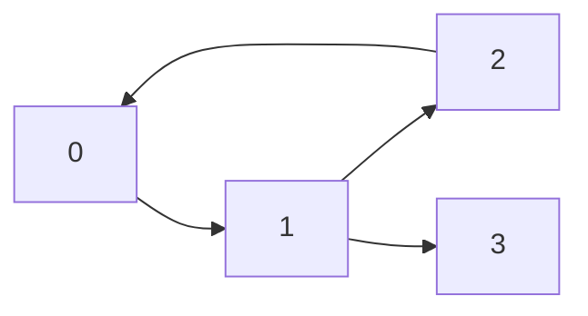

# Graph



## Dictionary

```python
graph = collections.defaultdict(list)
# list: (edge,path)
```

- The graph of the above example is :

  ```python
  {0:[(1,1)]
   1:[(2,1),(3,1)]
   2:[(0,1)]}
  ```

  

## B(readth)F(irst)S(earch)

```python
# graph:
# start: start vertex
def bfs(graph,start):
  # Since it is possiblet to visit each node more than once, we use a set to record visited node.
    visited = set()
    queue = collections.deque()
    queue.append(start)
    while queue:
        node = queue.popleft()
        visited.add(node)
        for vertex,path in graph[node]:
            if vertex not in visited:
              visited.add(vertex)
```

- Time complexity $O(V + E)$
  - V is the number of node in graph
  - E is the edges in the graph

## D(epth) F(irst) S(earch)

```python
# using recusion to perform dfs
def dfs(graph,start):
  visited  = set()
  def recur (node):
    visited.add(node)
    for vertex,path in graph[node]:
      if vertex not in visited:
        recur(vertex)
  recur(start)
```


- Time complexity $O(V + E)$
  - V is the number of node in graph
  - E is the edges in the graph

## Dijkstra's Algorithm

```python
# using priority queue to perform Dijkstra
def dijk(graph,start):
  prior_queue = [ (0, start) ]
  while prior_queue:
    # using pq so we can access smallest cost every time
    cur_cost,node = heapq.heappop(prior_queue)
    for vertex,cost in graph[node]:
      heapq.heappush(prior_queue,(cur_cost+cost, vertex))
```

- Time complexity $O()$
  - V is the number of node in graph
  - E is the edges in the graph

## Floyd warshall

```python
# dynamic programming
# n the number of vertex in graph
# initialize cost from vertex to another is infinity
dis = [[float('inf')] * n for _ in range(n)]
# set connected vertices cost 
for star, end, cost in edges:
  dis[start][end] = dis[end][start] = w
# assume cost from one vertex to itself is 0
for i in range(n):
  dis[i][i] = 0
for k in range(n):
  for i in range(n):
    for j in range(n):
      dis[i][j] = min(dis[i][j],dis[i][k]+dis[k][j])
```

